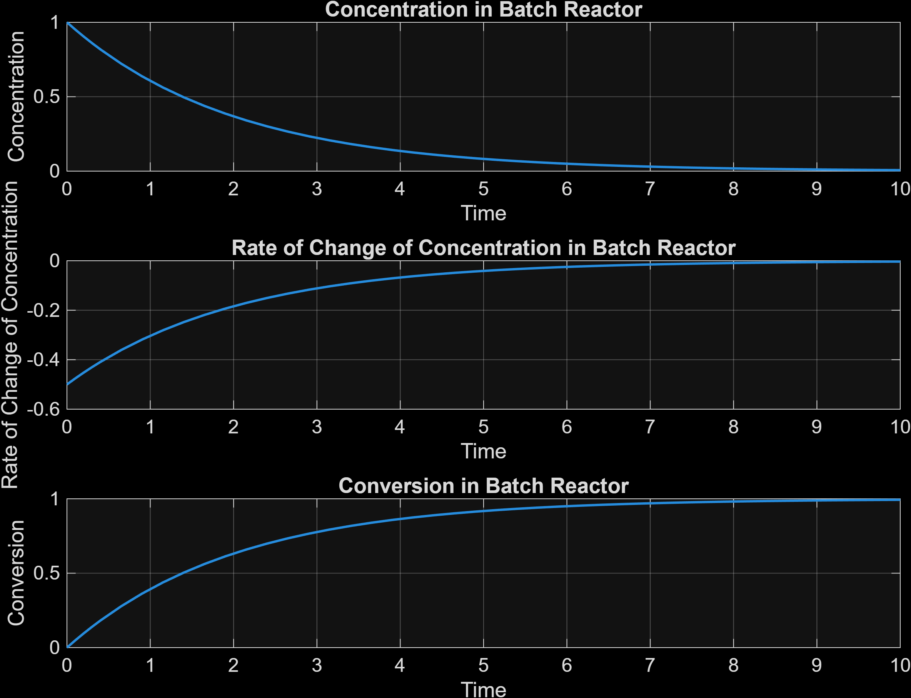
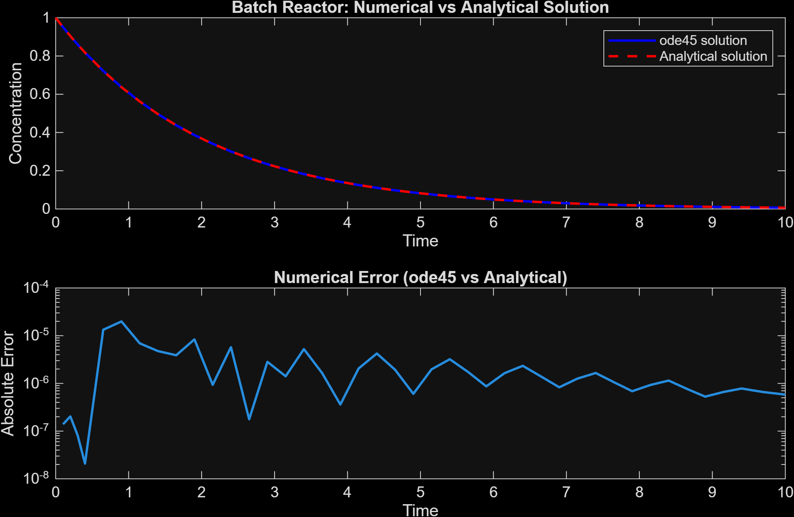
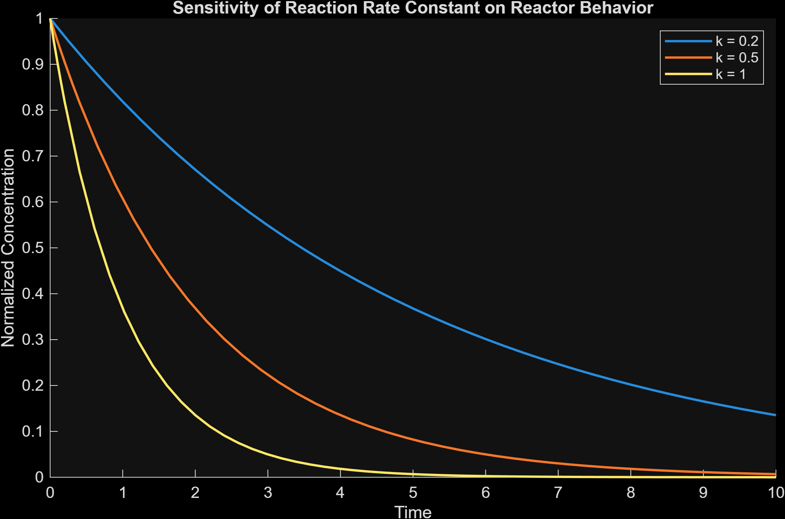

# Batch Reactor Kinetics Simulator


<p align="center">
  
</p>

<p align="center">
Concentration, rate of change, and conversion of reactant A in a first-order batch reactor.
</p>

---

A MATLAB-based simulation of a first-order batch reactor used in chemical reaction engineering.

The project solves the **batch reactor design equation** using MATLAB's numerical ODE solver and compares the numerical solution with the analytical solution. The simulation also visualizes concentration decay, reaction rate behavior, conversion, and numerical error.

This project demonstrates how chemical reactor kinetics can be modeled using numerical methods and scientific computing in MATLAB.

---

# Overview

Batch reactors are commonly used in chemical processing when reactions must occur in a closed system without continuous inflow or outflow.

In a batch reactor, the concentration of reactants changes over time as the reaction proceeds.

This simulation models the time evolution of reactant concentration in a batch reactor with first-order reaction kinetics and visualizes key reactor performance variables.

---

# Reaction System

Reaction:

A → Products

First-order reaction kinetics:

r = -kC

Where:

- r = reaction rate (mol/L·s)
- k = reaction rate constant (1/s)
- C = concentration of reactant A (mol/L)

---

# Batch Reactor Model

For a batch reactor, the mole balance gives the governing differential equation:

dC/dt = r

Substituting the first-order rate law:

dC/dt = -kC

This ordinary differential equation describes how the concentration of reactant A decreases over time as the reaction proceeds.

The equation is solved numerically using MATLAB's ODE solver.

---

# Analytical Solution

For a first-order reaction in a batch reactor, the concentration also has a known analytical solution:

C(t) = C₀ e^(-kt)

The simulator compares the numerical solution obtained using MATLAB's ODE solver with this analytical solution to verify accuracy.

---

# Engineering Outputs

The simulation generates the following outputs:

• Concentration vs Time  
• Reaction Rate vs Time  
• Conversion vs Time  
• Numerical vs Analytical solution comparison  
• Numerical error analysis (log scale)  
• Sensitivity of reactor behavior to reaction rate constant

Example outputs are included in the `example_plots/` folder.

---

## Example Model Outputs

<p align="center">

</p>

<p align="center">
Comparison between numerical and analytical solutions alongside numerical error analysis.
</p>

<p align="center">

</p>

<p align="center">
Effect of reaction rate constant on reactor behavior.
</p>

---

# Project Structure
```
batch-reactor-kinetics-simulator
|
|--- main.m
|--- batch_ode.m
|--- plot_results.m
|--- README.md
|
|--- example_plots/
     |--- batch_reactor_simulator.png
     |--- numerical_vs_analytical.png
     |--- varying_k.png
```

---

# Installation

### Clone the repository

git clone https://github.com/MatthewNguyen865/batch-reactor-kinetics-simulator.git


### Run the simulation

Open the project in MATLAB and run:

main.m

The program will prompt the user to enter reactor parameters and generate plots describing the reactor behavior.

---

# Technologies Used

• MATLAB  
• Numerical ODE solvers (ode45)  
• Scientific data visualization

---

# Skills Demonstrated

## Chemical Engineering

• Batch reactor modeling  
• Reaction kinetics  
• Reactor mole balances  
• Conversion analysis  
• Numerical validation with analytical solutions  

## Programming

• Numerical solution of differential equations  
• MATLAB scripting and functions  
• Data visualization  
• Modular program structure

---

# Future Improvements

Potential extensions for the simulator:

• Higher-order reaction kinetics  
• Multiple reaction systems  
• Temperature-dependent kinetics (Arrhenius equation)  
• Non-isothermal batch reactor modeling  
• Parameter estimation from experimental data  
• Interactive parameter input interface

---

# Author

Matthew Nguyen  
Chemical Engineering Student  
Texas A&M University